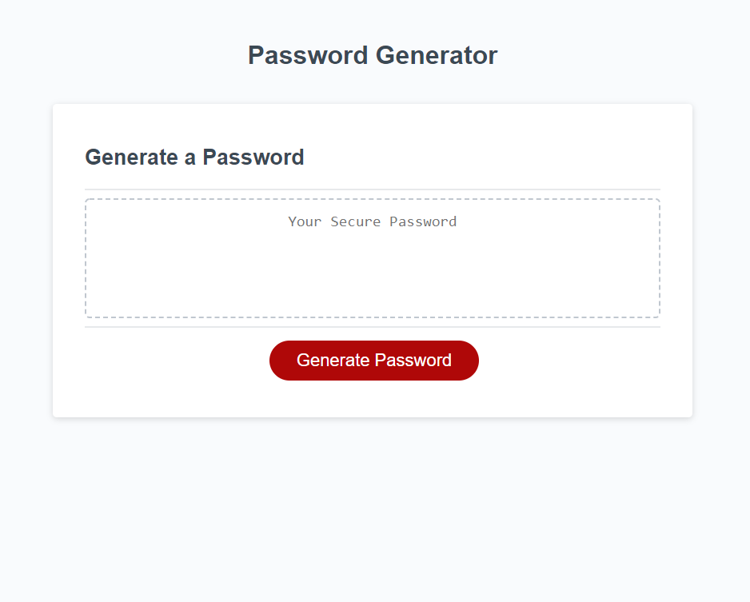

This is a random password generator that had a button when clicked, prompts criteria for 4 different catagories of characters that the user chooses to be in their random password. The user may also choose how many characters of each catagory to be in their password. The catagories are lower-cased letters, upper-cased letters, special characters, and numbers. The password is then displayed on the webpage.

https://scotitakura.github.io/Password-Generator/